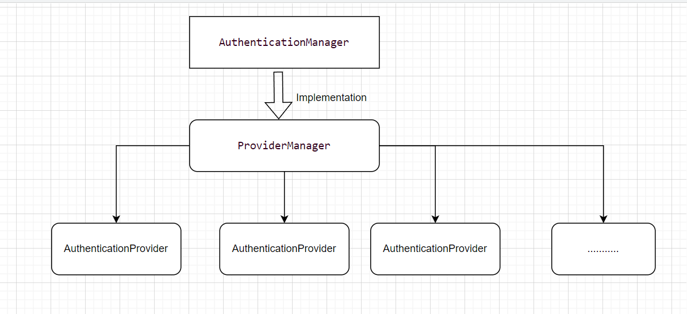
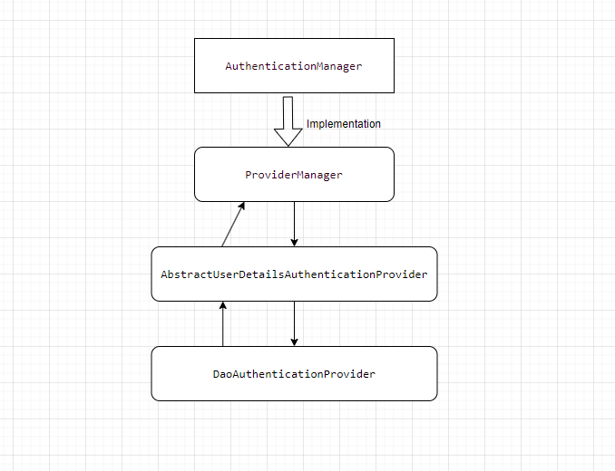

# ecommerce-spring

### Requirements

#### As a user I want

* Land in the home page without log in
* Home page will show newly updated products
* Home page will show categories. NO SUB CATEGORY
* User can visit product details without log in
* Add to cart will trigger the signin/signup process.
* After successful sign in user can add products to cart
* For placing order user must have at least one shipping address
* Default payment method - cash on delivery
* Placing the order and admin should get notified
* User can visit his/her profile and edit
* User can visit all his/hers order history
* User can filter products by category

#### As an admin I want
* To see all recent orders
* To change the status of those orders.
* To add, update,delete products
* To see all products
* To add, update, delete category

## Knowledge base : 

### Spring Security : 

####  Authentication :
The main strategy interface for authentication is `AuthenticationManager` . 
The most common implementation of `AuthenticationManager` is `ProviderManager`, 
which delegates to a chain of `AuthenticationProvider`.  
A `ProviderManager` can support multiple different authentication mechanisms in the same application by 
delegating to a chain of `AuthenticationProviders`. 

More info : [visit here](https://spring.io/guides/topicals/spring-security-architecture)

  

In our implementation it looks like following : 

  

#### Authorization : 

Previously Spring Security had voter-based architecture . Now `AuthorizationManager` supersedes voter-based architecture.
For example in our case we are using `PreAuthorizeAuthorizationManager` which is invoked by filter. `PreAuthorizeAuthorizationManager`
make decision based on evaluating Expressions with an `Authentication` object.In our case we are intercepting and 
providing Authentication by our `AuthTokenFilter` . 